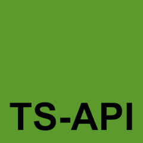

# ts-api-template

A template for boilerplating a Node.js TypeScript Express API. Support for importing PureScript modules is included. Database migrations are made with Sequelize. Swagger endpoint is located at `/docs` to add documentation for your API.

## Requirements

- Spago
- Node.js 10.16.2
- Docker

## Installation instructions

1. Run `npm install -g spago`
2. Run `spago install`
3. Run `npm install`

### Development

The development environment starts webpack in watch mode. The bundled app is then monitored with nodemon.

- Run `npm run build:dev` to start webpack in watch mode
- Run `npm run start:dev` to start nodemon

### Production

- Run `npm run build` to bundle the app
- Run `npm start` to start the app

### With Docker

You can run the whole stack with `docker-compose up -d --build`.

## License

MIT license
